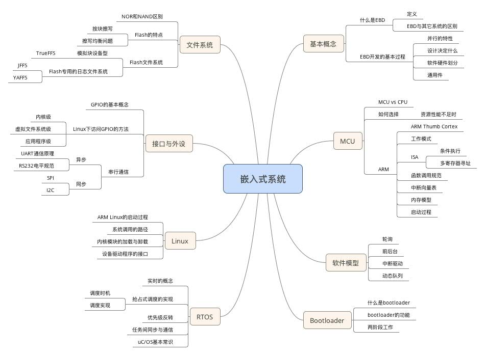

## 嵌入式知识点总结


###  基本概念

##### 什么是嵌入式系统

嵌入式系统，是一种完全嵌入受控器件内部，为特定应用而设计的专用计算机系统。

将计算机的硬件或软件嵌入到其它机电设备中去，所构成了一种新的系统。

以应用为中心，以计算机技术为基础，软硬件可裁剪，适应应用系统对功能、可靠性、成本、体积、功耗等严格要求的专用计算机系统，用于实现对其它设备的控制、监视、管理等功能。

##### 与桌面计算机的不同

与个人计算机这样的通用计算机系统不同，嵌入式系统中运行的程序是专用而确定的，而桌面系统需要支持大量的需求多样的程序。

**实时系统：**系统能在限定的响应时间内提供所需水平的服务。

##### 嵌入式系统特点

功能、实时性、高可靠性、体积、功耗约束、成本、资源少（够用就行）

嵌入式系统的标志：能否在运行时方便的装入新的程序运行。

##### 并行性的特性

通常并行执行多个功能。

软件硬件划分：什么功能用软件实现，编程模型、操作系统。硬件选型，电池。 

上位机和下位机：PC 是上位机。一条线下载、一条线调试。

仿真机：把板卡 CPU 拔下，插入仿真器，具有完全的硬件能力。

虚拟机：PC 上模拟 CPU，GPIO 输出都是假的。

测试标准接口：JTAG


### CPU

##### MCU 与 CPU 区别

CPU：只有指令译码执行部分，不带有外设。在嵌入式系统中叫 MPU

MCU 带有外部设备，至少有定时器和 GPIO，一般还具有 UART、ADC，有的还有存储器。

SoC：带有存储器及某个特定外设的 MCU。

##### Cortex

Cortex-A：Application，用于手机平板，目标是取代 X86

Cortex-R：Real-time

Cortex-M：micro-controller，传统单片机，没有 MMU，不跑 OS 或跑 RTOS

##### ARM

Load/store 架构

32 位 ARM 为资源丰富，高性能计算系统优化设计，而低端设备是不同的。

Thumb 采用 16 位指令，降低了内存需求（代码密度）也降低了性能。

Thumb2 以 16 位为基础，混合 32 位，ARM 与 Thumb 并存，存在切换开销。

##### ARM 指令

ARM 快中断 fiq：寄存器问题，中断时换一组寄存器

带条件执行，S 标志要不要修改寄存器，标志寄存器控制后一条指令跳转。

MOV R1, R2, LSL #3	R2 左移 3 位放入 R0

LSR：逻辑右移，ASR：算数右移

LDR R1, [R2]		将 R2 指向的内存地址内容取出

函数调用：

```
BL SUBR		#在跳转前将 PC+4 存入 R14
...
SUBR:
...
MOV PC, R14	#返回时将 R14 移入 PC(R15)
```

##### 启动

启动是一个中断，而不是从 0 地址开始执行，rst 启动中断是中断向量表的第一项。

0x00：Stack Pointer

0x04：Reset Vector，程序开始地址


ISP：In SYSTEM Programing，在系统编程

ICP：In CIRCUIT Programing，在电路编程

IAP：In applicating Programing，在应用编程


​				

### 软件模型

##### 调度方式

1. MCU 的中断系统实现了基本的中断方式，每次硬件事件发生久运行这个子程序，适用于简单的程序。
2. 复杂的系统需要支持多个独立的线程并行执行，用任务调度器来共享 CPU

##### 调度的两个基本问题

1. 是否每次以相同顺序执行这些任务：静态调度、动态调度
2. 是否可以抢占其它任务：抢占、非抢占

##### 轮询

将循环中的代码分解为多个部分，每个任务有确定的执行时间，整个循环也有确定周期。

特点：延时通过循环实现，IO 通过循环等待确定完成。

优势：执行时间可预计，内存可预计，没有共享数据冲突，程序简单。

问题：无法对外部事件做出及时响应。一个工作要很长时间完成，后续任务必须要等待。

例如，一个设备最长响应时间要小于循环周期。

适用：不需及时响应：风扇。不能接受执行过程不确定：卫星。

##### 前后台

中断处理硬件紧急请求，并设置标志位。

主循环轮询标志，进行后续处理。

例如：键盘，中断与外界交互、写入缓冲区、设置标记，主循环检查标记并读取缓冲区处理。

特点：定时器由中断实现，不在主循环中做外设的等待，由等待外设变为等待标志。

优点：紧急任务中断处理，大量计算任务放在主循环，对其它任务的影响减轻了。代码清晰。

困难：共享数据冲突。被认为是轮询的变种。

优先级：主循环可以增加高优先级任务的检查机会。

##### 中断驱动

主循环配置好就去睡眠。

只在中断里处理事物。中断响应程序不能做很久。

特点：没有主循环，大量时间睡眠功耗低，类似事件驱动的GUI程序，适合功能简单、任务间冲突小的程序。

##### 动态队列

将各个任务编写成函数，中断将该任务指针放入队列，主循环不断读取队列并执行该函数。

类似前后台。主循环做事的顺序不确定。

优点：主循环可以按任意优先级来调度队列中的函数。更好的响应时间。

缺点：如果低优先级在执行很久，高优先级必须要等待。编程复杂。饿死。

##### 问题

上面四种模型都没有很好地解决高优先级功能响应速度的问题。

1. 在轮询和前后台中，高优先级每次只能得到一次执行机会。
2. 在动态队列中，如果低优先级已经开始执行，高优先级必须要等待。

理想模型应该高优先级功能只要想执行就能获得 CPU。

##### 


### Bootloader

##### 定义

上电之后，到系统启动之间。初始化硬件设备，将系统带到一个合适的环境。

##### 分类

1. 芯片内的 ISP 程序，只能下载烧录程序，不占用地址空间。
2. 第三方 Bootloader，在地址空间中，需要用其他方式先烧录。

只有在 ROM 和 Flash 中的程序启动时可以直接访问，DRAM 需要初始化控制器后才能访问。

每种不同的 CPU 体系结构有不同的 Bootloader。

操作模式：启动加载模式和下载模式

##### 两阶段工作：

1. 把 CPU 带到合理的状态，与操作系统无关的。
2. 把嵌入式系统的可执行代码放到 SDRAM 中。

Bootloader 本身在 Flash 中运行。

BSP板级支持包 是操作系统中与硬件相关的部分，Bootloader 与系统无关。


### RTOS

##### 实时系统

系统能在限定的响应时间内提供所需水平的服务。

评价指标：

1. 强实时：响应时间 us~ms 级别，数控机床
2. 一般实时：ms~s 级，打印机
3. 弱实时：s 级以上，工程机械

##### 任务切换

当操作系统需要运行其他任务时，系统会首先保存和当前任务相关的寄存器的内容到当前任务的栈中；然后从将要被加载的任务的栈中取出之前保存的全部寄存器的内容并加载到相关的寄存器汇总，从而继续被加载任务的运行。

##### 任务调度算法

时间片轮转：无法处理更紧急任务。

优先级调度：高优先级就绪，一定发生抢占。高优先级一直占据，其他任务无法执行。

基于优先级的时间片调度：相同优先级采用时间片，不同优先级采用优先级调度。

##### 任务状态

就绪：任务已获得了除处理器之外的一切需要的资源，等待任务调度。

运行：任务得到了所需资源，正在 CPU 运行

等待：却少某些必须的运行条件或资源而不能参与任务调度。

**抢占时机：**队列中出现的任务优先级更高。任务主动发起或外部中断。

##### 优先级反转

在优先级多任务系统中引入互斥方案，会导致优先级反转。

低优先级任务占有资源，高优先级任务申请该资源阻塞，因此不能抢占。

这时，中优先级任务可以抢占低优先级任务，间接抢占了高优先级任务。

##### 优先级继承

低优先级任务改变它的优先级为所有申请它所占有资源的任务的最高优先级，任务释放资源后，恢复原优先级。

##### 中断机制

外部中断：系统外设发出的中断，如：串口数据、键盘。外部中断可以屏蔽。

内部中断：处理器自身的原因引起的异常事件，如：非法指令、运算出错。基本上不可屏蔽。

软件中断：由程序通过软件指令触发，从而主动引起程序流程的变化。如：用户及程序在某时刻需要访问处理器中收到保护的寄存器，则可以通过软中断进入系统级，实现权限的提升。

##### 中断嵌套

处理中断时发生其他中断，简单的方法是直接关闭中断。或者采用中断嵌套。

高优先级中断抢占低优先级中断。同级中断不可抢占。不能立刻响应的被悬挂。

##### ISR：中断服务程序

##### 任务同步通信

不可重入，互斥的访问机制。

##### 提升实时性方法

任务调度算法

可抢占内核：内核服务可响应中断，内核推出后可进行调度。

系统运行状态：不划分系统和用户空间，减少空间切换开销，缺点时可能破坏内核。

存储管理：不支持虚拟存储，不支持动态内存分配。

任务互斥同步：资源不是必须的话有限等待，优先级反转解决调度中的资源竞争。

中断处理：中断嵌套，确保高优先级中断及时处理。

内核可剪裁可配置性


### uc/OS

以函数库的形式存在。创建任务分配全局变量做为堆栈，并设置优先级。

临界区保护采用关中断方式。

处理器中 PC 和 SP 寄存器分别与内存中的任务代码和堆栈建立联系。

##### 运行环境

处理器中：SP、PC、寄存器堆

内存中：任务堆栈。任务代码不算。

##### 多任务

虚拟存储器保存每个任务的处理器环境。

在内存中为每个任务保存虚拟存储器。需要运行时将该任务的虚拟存储器复制到实际存储器中。终止时将实际存储器内容换出。

任务的切换实际就是运行环境的切换。

##### 任务控制块

系统另行构造每个任务的控制块，保存优先级、SP 等。

**任务三要素：**程序代码、私有堆栈、控制块。

##### uc/OS 任务管理

独特的就绪表结构，快速查找高优先级任务。

OSTaskIdle() 空闲任务：系统在无用户任务可运行时调度这个任务，只做计数工作。

一共有 64 个优先级。

##### 切换过程

1. 根据就绪表获得待运行任务的控制块
2. 处理器 SP ＝ 任务控制块中 SP
3. 根据 SP 地址的内容恢复运行环境
4. 处理器 PC ＝ 任务堆栈中的 PC 断点地址。

##### 内存分配

对固定大小的内存进行操作，将连续内存分为若干分区，每个分区又分成大小相等的内存块。


### Linux

**哈佛结构：**数据和程序分开存储器。相对于冯诺伊曼结构。


##### ARM Linux 的启动过程

head.S 是 linux 运行的第一个文件。

启动主线：

1. 确定 process type：确保运行在 SVC 草鸡用户模式下，并且中断关闭
2. 确定 machine type
3. 创建页表：kernel 所有符号链接是都使用了虚拟地址。跳到 start kernel 之前必须能够使用MMU，但在开启 MMU 之前要先创建页表。
4. 调用平台特定的 CPU flush 函数：清除 Cache、清除 TLB、清除 Writebuffer
5. 开启 MMU
6. 切换数据

##### 系统调用的路径

arch/arm/kernel/call.S 添加系统调用表项。


##### 外部设备

无论片内片外，CPU 核心之外的设备都可以称为外部设备，因为都需要写程序去操纵。

二层接口外设：设备驱动程序实现外设操作，首先要实现基础的接口操作。

裸机写外设很简单，地址固定。但是 Linux 有 MMU，用户态内核态不同，直接访问外设使OS无法管理资源。需要设备驱动程序为应用程序和实际硬件之间的桥梁，应用程序向OS请求，OS执行实际的设备驱动程序。

设备驱动程序不能自动执行，只能被操作系统或应用程序调用。

**设备驱动程序表：**IO 管理子系统对设备的管理，描述了所有驱动程序及所支持的操作。

##### 设备标识

主设备号：该设备种类，以及所使用的驱动程序。

从设备号：同一设备驱动程序的不同设备硬件。

##### 文件形式接口

Unix 将所有设备统一以文件形式提供接口。简单、统一。每一个设备在 /dev 下有一个文件。

应用程序打开 /dev 下对文件，进行各种操作，OS 将应用的调用及参数转给注册过的对应的设备驱动程序的对应函数。

##### 驱动开发三部曲

1. mknod 创建设备文件
2. 编写处理文件各个操作的函数
3. 构造 file_operation 结构，注册到对应的设备文件


### 接口与外设

处理器的用途是手持、桌面计算机，IO 是为人机交互服务的。

嵌入式微控制器的用途是控制其他设备，IO 是为控制（输入／输出）服务的。

GPIO 基本概念：就是由 CPU 可以直接操纵的引脚。通用输入输出，复用的，输入输出不能同时存在。通过总线挂到总线，总线控制器控制 GPIO，控制器映射到内存空间的地址。

##### 访问方式

内核驱动程序：驱动程序实现了一套C函数，内核其他部分可以用它们来建立使用GPIO的某种具体的硬件设备的驱动。这个级别的程序在读写引脚时具有非常低的延迟。

虚拟文件系统：通过 sysfs 目录中的特殊文件控制 GPIO，读写这些文件，内核中的程序会被调用来实现所需功能。受到系统调度延迟和系统负载的影响。

应用程序库


### 串行通信

##### 异步通信

UART：通用异步收发器，接口设备，实现串并转换。

异步通信：以字符为单位进行传输，字符与字符之间的间隙是任意的，但字符中各位是以固定时间传送的。

异步特点：不要求时钟严格一致，实现容易，设备开销小。但字符要有起始位，各帧要有间隔，传输效率低。

##### 同步通信

同步通信要求发送方时钟对接收方时钟的直接控制，使双方达到完全同步。

DTE：Data Terminal Equipment

DCE：Data Communication Equipment

##### 速率

比特率：每秒传输二进制的位数。 

9600 8N1：比特率 9600，8 个数据位，无奇偶校验，1 个停止位。

波特率：每秒调制信号变化的次数，如果只用高低电平表示，与比特率相等。

##### RS232 算是异步？

由于传输过程有很多问题，EIA-RS-232C 对电气特性、逻辑电平和各种信号线功能做出了规定。例如：规定电压大小范围、正负等。就是计算机的串口。

TxD：发送数据，DTE->DCE

RxD：接收数据，DCE->DTE

RS232：1 电平低电压，但控制线不反转。

传输距离短、速率低。

***UART、RS232 属于外部接口。***

内部接口：SPI、I2C，CPU 直接跟器件通信。

##### SPI（串行外围接口）

SPI接线：4线，MOSI 主输出从输入，MISO 相反，SPICLK 时钟，SPICE 从发送使能。

通信双方是不平等的。支持一个主设备控制多个从设备。

##### I2C 总线

双线：SCL－CLock Line，SDA－数据线（双向）


### 文件系统

##### Flash

NOR：具有独立地址线、数据线，支持快速随机访问，容量小。按字节为单位随机读写，具有芯片内执行功能。适合于做小的程序存储。

NAND：地址线、数据线共用，读写通过接口 512 字节块，容量大。专门为数据存储。

比较：NAND 写入、擦除更快，NOR 带有 SRAM 接口实现随机读写。

##### Flash 特点

写入前必入先按块擦除。

损耗均衡问题：每个块都具有擦除次数的上限，称为擦除周期数。管理算法。

位交换问题：经常一个 bit 发生反转。

坏块处理：NAND 中的坏块随机分布，消除坏块代价太高，所以初始化阶段扫描标记坏块。

掉电保护：文件系统一致性。

##### Flash 文件系统

针对 Flash 的硬件特性，目前闪存文件系统有两种思路：

1. 硬盘模拟法：将闪存设备模拟成具有 512 字节扇区的块设备，在此基础上使用成熟的磁盘文件系统。
2. 直接实现法：直接对闪存设备进行操作，建立日志文件系统，避免模拟转化工作。

##### 模拟块设备

为了提供负载均衡，将扇区存放在不同位置，地址转化层用语记录每个扇区位置，有类似 MMU 映射。

三个层次：

1. 设备驱动程序层：实现对 Flash 设备的最基本操作。
2. 地址转化层：设备地址和逻辑地址相互转化和数据对应关系的动态处理。
3. 文件系统管理层：将文件系统操作转化为 Flash 操作。

特点：通用性强，移植性好，适合商业系统，例如：TrueFFS、MFFS 等。

TrueFFS 与 FAT 比较：FAT 表可以在一定范围内移动，否则经常访问会挂掉。

##### 直接实现法

使用块设备模拟不能充分发挥 Flash 特性，去掉 FTL 这一层转化将对性能有很大提升，并且没有完整性保护。

日志文件系统：对数据的更新采用向前写入，即更新的数据写入空白块，而不覆盖原先的数据，避免数据块擦除。同时保证了意外情况的数据安全存储，可以通过检查点回滚将数据恢复。

适用于资源少，速度要求快，以及可靠性高的应用场合，缺乏通用型。

JFFS、YAFFS


